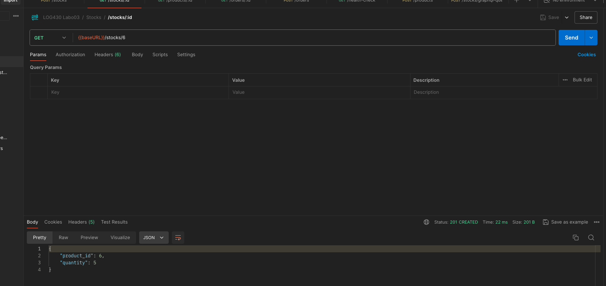
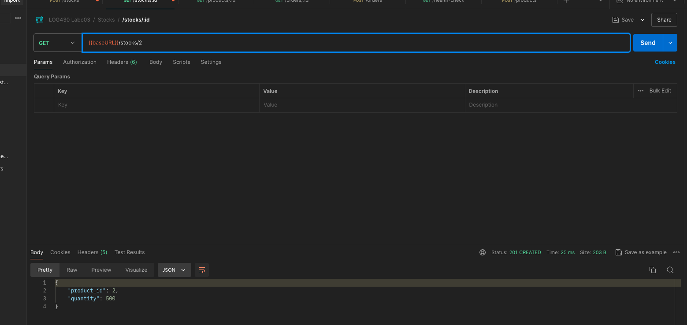
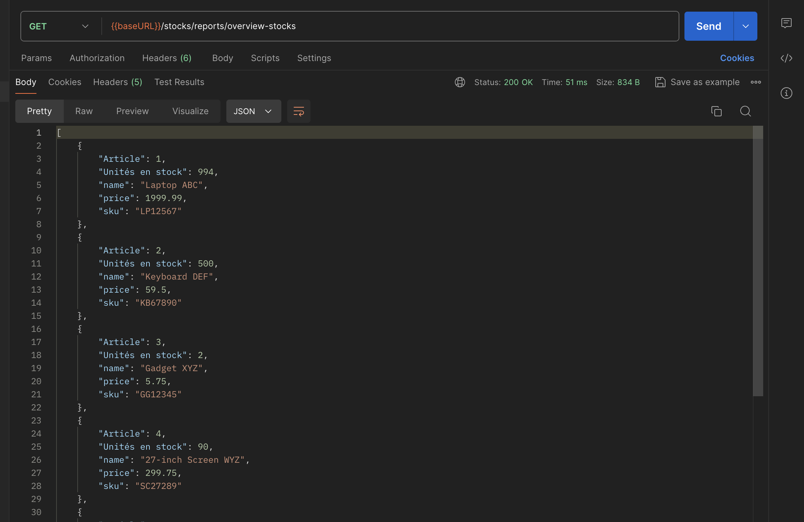
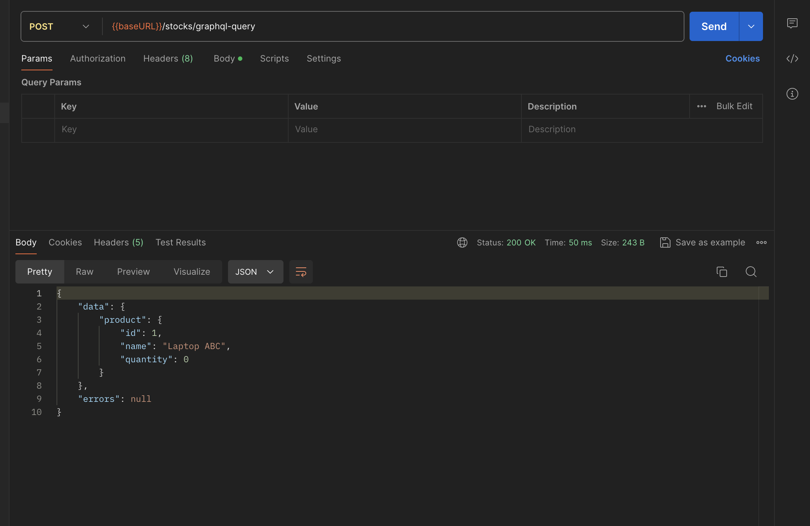
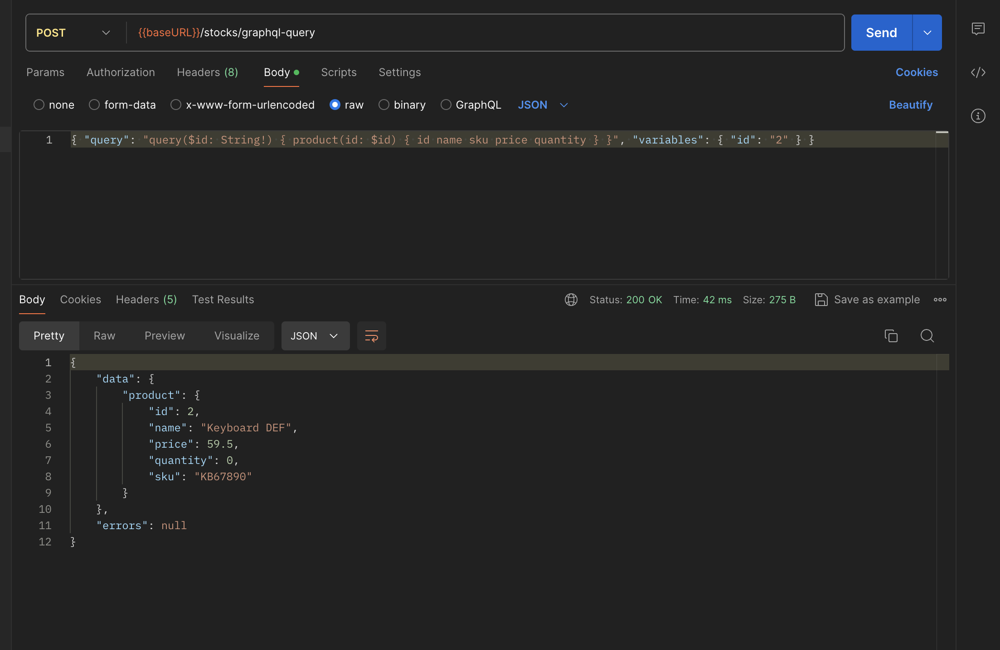

# Labo 03 — Rapport

 \
Reda El Mansouri ELMR90070104 \
Rapport de laboratoire \
LOG430 — Architecture logicielle \
2025-10-03 \
École de technologie supérieure

## Questions

#### Question 1 : Quel nombre d'unités de stock pour votre article avez-vous obtenu à la fin du test ? Et pour l'article avec id=2 ? Veuillez inclure la sortie de votre Postman pour illustrer votre réponse.
- À la fin du test, le stock de l’article créé revient à 5 unités (après avoir passé une commande de 2 unités puis supprimé la commande).
- Pour l’article avec id=2, le stock est de 500 unités (données initiales).

Extraits de réponses sur Postman:

- GET http://localhost:5001/stocks/{id_article_créé}



- GET http://localhost:5001/stocks/2



Notes:

- Le test d’intégration `test_stock_flow` (dans `src/tests/test_store_manager.py`) exécute les étapes suivantes: création d’un produit, ajout de 5 unités en stock, commande de 2 unités, vérification du stock (3), suppression de la commande, puis vérification finale (5). Il imprime également les quantités observées pour transparence et inclut une lecture du stock pour l’article id=2.
- La collection Postman utilise http://localhost:5001 comme baseURL (port mappé par Docker).


#### Question 2 : Décrivez l'utilisation de la méthode join dans ce cas. Utilisez les méthodes telles que décrites à Simple Relationship Joins et Joins to a Target with an ON Clause dans la documentation SQLAlchemy pour ajouter les colonnes demandées dans cette activité. Veuillez inclure le code pour illustrer votre réponse.
- Nous n'avons pas de relation ORM déclarée entre `Stock` et `Product`, donc nous utilisons la forme « Joins to a Target with an ON clause » de SQLAlchemy, en passant explicitement la condition de jointure.
- La requête joint `Stock.product_id` avec `Product.id` et sélectionne les colonnes demandées (`name`, `sku`, `price`) en plus de la quantité.

Code utilisé (extrait de `src/stocks/queries/read_stock.py`):

```python
results = session.query(
	Stock.product_id,
	Stock.quantity,
	Product.name,
	Product.sku,
	Product.price,
).join(Product, Stock.product_id == Product.id).all()

stock_data = []
for row in results:
	stock_data.append({
		'Article': row.product_id,
		'name': row.name,
		'sku': row.sku,
		'price': row.price,
		'Unités en stock': int(row.quantity),
	})
```

Remarque: avec une relation ORM définie (p. ex. `Stock.product = relationship('Product')`), on pourrait utiliser la forme « Simple Relationship Joins » plus concise: `.join(Stock.product)`.

Capture(s) Postman à inclure pour cette question:
- GET http://localhost:5001/stocks/reports/overview-stocks affichant une ligne contenant les champs: `Article` (id), `name`, `sku`, `price`, `Unités en stock`.




#### Question 3 : Quels résultats avez-vous obtenus en utilisant l’endpoint POST /stocks/graphql-query avec la requête suggérée ? Veuillez joindre la sortie de votre requête dans Postman afin d’illustrer votre réponse.
Pour tester l’endpoint GraphQL, j’ai utilisé Postman avec les paramètres suivants:

- Méthode: POST
- URL: http://localhost:5001/stocks/graphql-query
- 
Résultat obtenu:




Interprétation:
- Le serveur renvoie bien l’objet product avec les colonnes demandées (id, quantity).
- La quantité correspond aux données d’initialisation (500 pour l’article id=2).
- Le champ errors est nul, ce qui confirme le succès de la requête.


#### Question 4 : Quelles lignes avez-vous changé dans update_stock_redis? Veuillez joindre du code afin d’illustrer votre réponse.

Dans `update_stock_redis`, j'ai remplacé le `hset`  qui écrivait uniquement `quantity` par un `mapping` complet:

Avant:

```python
pipeline.hset(f"stock:{product_id}", "quantity", new_quantity)
```

Après (lignes ajoutées/modifiées):

```python
from stocks.queries.read_product import get_product_by_id  # (import ajouté en haut du fichier)

# ... à l’intérieur de update_stock_redis
prod = get_product_by_id(int(product_id)) or {}
base_mapping = {
	"quantity": int(new_quantity),
	"name": prod.get("name"),
	"sku": prod.get("sku"),
	"price": prod.get("price"),
}
# Évitons d’écrire des valeurs None dans Redis
mapping = {k: v for k, v in base_mapping.items() if v is not None}
pipeline.hset(f"stock:{product_id}", mapping=mapping)
```

Contexte: j’ai également harmonisé deux autres points du même fichier pour garantir que Redis dispose toujours des métadonnées produit:

- Dans `set_stock_for_product(...)`, on écrit maintenant un `mapping` complet (quantity + name + sku + price) juste après la mise à jour MySQL.
- Dans `_populate_redis_from_mysql(...)`, on fait une jointure avec `products` pour initialiser Redis avec quantity + name + sku + price.

Ces deux changement vont permettre a Redis de disposer toujours des métadonnées produit.


#### Question 5 : Quels résultats avez-vous obtenus en utilisant l’endpoint POST /stocks/graphql-query avec les améliorations ? Veuillez joindre la sortie de votre requête dans Postman afin d’illustrer votre réponse.

Requête utilisée dans Postman:

```
POST http://localhost:5001/stocks/graphql-query
Content-Type: application/json

{
	"query": "query($id: String!) { product(id: $id) { id name sku price quantity } }",
	"variables": { "id": "<ID_PRODUIT>" }
}
```

Exemple de résultat attendu Sur Postman:



Interprétation:
- `name`, `sku`, `price` proviennent de MySQL (et sont également mis en cache dans Redis).
- `quantity` provient de Redis.
- Le champ `errors` doit être nul si la requête est réussie.

#### Question 6 : Examinez attentivement le fichier docker-compose.yml du répertoire scripts, ainsi que celui situé à la racine du projet. Qu’ont-ils en commun ? Par quel mécanisme ces conteneurs peuvent-ils communiquer entre eux ? Veuillez joindre du code YML afin d’illustrer votre réponse.

En commun:
- Les deux fichiers `docker-compose.yml` (à la racine et dans `scripts/`) déclarent et utilisent le même réseau Docker externe nommé `labo03-network` (driver `bridge`, `external: true`). Cela permet aux conteneurs lancés depuis des projets Compose distincts de partager un réseau et de se découvrir.

Mécanisme de communication:
- Sur un réseau Docker « user-defined » (ici `labo03-network`), Docker fournit un DNS interne. Les conteneurs peuvent se résoudre par nom de service ou par alias réseau. Ainsi, l’application fournisseur (`supplier_app`) peut appeler l’API du magasin via son nom/alias sur ce réseau, sans dépendre des ports exposés sur l’hôte.

Extraits YML (illustration):

Racine (`docker-compose.yml`):

```yaml
services:
	store_manager:
		# ...
		networks:
			labo03-network:
				aliases:
					- store-manager
		# ...

networks:
	labo03-network:
		driver: bridge
		external: true
```

Scripts (`scripts/docker-compose.yml`):

```yaml
services:
	supplier_app:
		build: .
		environment:
			- PYTHONUNBUFFERED=1
		volumes:
			- .:/app
		networks:
			- labo03-network

networks:
	labo03-network:
		driver: bridge
		external: true
```

Voici la réponse dans le terminal : 
```zsh
supplier_app-1  | 2025-10-03 22:38:12,893 - INFO - Starting periodic calls to http://store-manager:5000/stocks/graphql-query every 10 seconds
supplier_app-1  | 2025-10-03 22:38:12,893 - INFO - Press Ctrl+C to stop
supplier_app-1  | 2025-10-03 22:38:12,893 - INFO - --- Call #1 ---
supplier_app-1  | 2025-10-03 22:38:12,894 - INFO - Calling http://store-manager:5000/stocks/graphql-query (attempt 1/3)
supplier_app-1  | 2025-10-03 22:38:12,939 - INFO - Response: 200 - OK
supplier_app-1  | 2025-10-03 22:38:12,939 - INFO - Response body: {"data":{"product":{"id":1,"name":"Laptop ABC","price":1999.99,"quantity":0,"sku":"LP12567"}},"errors":null}
supplier_app-1  | ...
supplier_app-1  | 2025-10-03 22:38:12,939 - INFO - Waiting 10 seconds until next call...
supplier_app-1  | 2025-10-03 22:38:22,942 - INFO - --- Call #2 ---
supplier_app-1  | 2025-10-03 22:38:22,943 - INFO - Calling http://store-manager:5000/stocks/graphql-query (attempt 1/3)
supplier_app-1  | 2025-10-03 22:38:22,978 - INFO - Response: 200 - OK
supplier_app-1  | 2025-10-03 22:38:22,979 - INFO - Response body: {"data":{"product":{"id":1,"name":"Laptop ABC","price":1999.99,"quantity":0,"sku":"LP12567"}},"errors":null}
supplier_app-1  | ...
supplier_app-1  | 2025-10-03 22:38:22,979 - INFO - Waiting 10 seconds until next call...
supplier_app-1  | 2025-10-03 22:38:32,981 - INFO - --- Call #3 ---
supplier_app-1  | 2025-10-03 22:38:32,982 - INFO - Calling http://store-manager:5000/stocks/graphql-query (attempt 1/3)
supplier_app-1  | 2025-10-03 22:38:33,015 - INFO - Response: 200 - OK
supplier_app-1  | 2025-10-03 22:38:33,016 - INFO - Response body: {"data":{"product":{"id":1,"name":"Laptop ABC","price":1999.99,"quantity":0,"sku":"LP12567"}},"errors":null}
supplier_app-1  | ...
supplier_app-1  | 2025-10-03 22:38:33,016 - INFO - Waiting 10 seconds until next call...
```

Exemple d’URL interne utilisée par le fournisseur sur ce réseau partagé:
- via alias: `http://store-manager:5000/stocks/graphql-query`
- (alternative selon configuration et noms générés) `http://log430-a25-labo3-store_manager:5000/stocks/graphql-query`

Remarques:
- Les ports mappés (ex.: `5001:5000` au niveau du host) servent à accéder depuis Postman/host. Entre conteneurs, on privilégie l’URL interne sur le réseau Docker (port « 5000 » du service API).
- L’usage d’un alias (`store-manager`) rend le nom plus stable et lisible pour les autres services.


## Observations additionnelles

